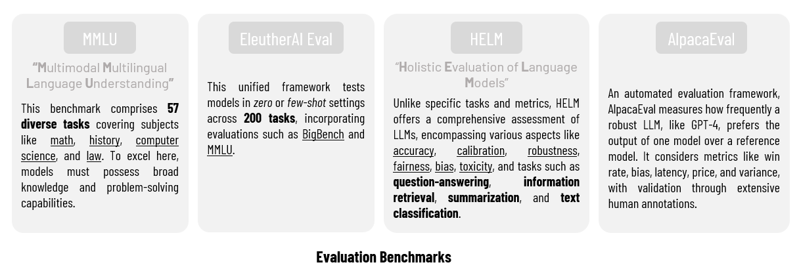

# **Evaluations: Measuring Performance**

Evaluations, often referred to as "evals", are crucial tools for assessing the performance of language models. These evaluations involve a series of measurements, including benchmark data and various metrics, that help us understand how well these models are performing in different tasks.

## **Why Are Evals Important?**

Evaluations play a pivotal role in the world of language models. They serve as a compass, helping us differentiate between those who rush to deliver mediocre outcomes and those who craft high-quality products. Here we're talking more about language models in production.

## **The Significance of Evals**

Evaluations are like the eyes we use to judge the effectiveness of our systems or products. Without them, we would be navigating blindly, relying solely on intuition rather than objective measurements.

These evaluations encompass a range of elements, from Large Language Models (LLMs) to prompt templates, retrieved context, and various parameters.

## **Exploring Different Evals metrics**

In the field of language modeling, there are numerous benchmarks used for evaluations. Here are some noteworthy ones:



### **Context-Dependent vs. Context-Free Metrics**

Metrics used in evaluations can be categorized into two main groups:

**Context-Dependent**: These metrics **consider the context of a specific task**, making them suitable for that task but requiring adjustments for other tasks. *Example: BLEU metric (will be discussed bellow).*

**Context-Free**: These metrics do not depend on context when evaluating generated output; instead, they compare the output with provided gold references. They are versatile and can be applied to a wide variety of tasks. *Example: BERTScore metric (also will be discussed bellow).*

### **Commonly Used Metrics**

To understand the effectiveness of language models, we often rely on several commonly used metrics, including:

* **BLEU (Bilingual Evaluation Understudy)**: BLEU is a **precision-based** metric widely used in machine translation. It counts matching n-grams between the generated output and the reference, offering an efficient way to assess translation quality.

* **ROUGE (Recall-Oriented Understudy for Gisting Evaluation)**: Unlike BLEU, ROUGE is **recall-oriented** and primarily used for automatic summarization tasks. It measures the overlap of words and n-grams between the output and the reference.

***~Example:***

```bash
pip install nltk
```

```bash
import nltk
from nltk.translate.bleu_score import sentence_bleu

# Reference and generated sentences
reference = ["this movie was awesome"]
generated = 'this movie was awesome too'

# Tokenize the reference and generated sentences
reference_tokens = [sentence.split() for sentence in reference]
generated_tokens = generated.split()

# Compute BLEU score
bleu_score = sentence_bleu(reference_tokens, generated_tokens)

print(f'BLEU Score: {bleu_score:.4f}')
# BLEU Score: 0.6687
```

* **BERTScore**: BERTScore employs cosine similarity to compare each token or n-gram in the generated output with the reference sentence. It excels at capturing synonyms and paraphrasing, making it valuable for tasks like image captioning and machine translation.

***~Example:***

```bash
pip install bert-score
```

```bash
from bert_score import BERTScorer

# Reference and generated sentences
references = ['I have a cat']
generated = 'The cat is on the mat'  # Example generated sentence

# Create a BERTScorer instance
scorer = BERTScorer(model_type='bert-base-uncased')

# Compute BERTScore
precision, recall, f1 = scorer.score([generated], references)

print(f'Precision: {precision.item():.4f}')
print(f'Recall: {recall.item():.4f}')
print(f'F1 Score: {f1.item():.4f}')
# Precision: 0.4888
# Recall: 0.5017
# F1 Score: 0.4951
```

## **Challenges with Traditional Metrics**


While these traditional metrics provide valuable insights, they come with their set of challenges. 

For instance, they often exhibit poor correlation with human judgments, especially in tasks requiring creativity and diversity. 

Additionally, these metrics may not adapt well to different tasks and can yield inconsistent results depending on evaluation implementation.

## **Emerging Trends in Evaluation**

A promising trend in evaluation involves **using a robust LLM as an automated referee** to assess the performance of other models. 

This approach eliminates the need for human judgments or gold references, offering an objective and efficient evaluation method.

## **How to Apply Evals?**

To effectively utilize evaluations, it is essential to choose appropriate tests, metrics, and datasets tailored to the specific task at hand. 

A well-structured evaluations are the foundation for improving language models. For example, in evaluating a language model's translation capabilities, one might use sentences in one language along with their correct translations in another language to assess performance accurately.

***~Example:*** Applying evaluations to improve the performance of a chatbot language model

Here's a visualization of the process: 


* **Goal:** To assess the chatbot's ability to provide helpful and relevant responses in a customer support context.

1. **Choose Appropriate Tests:** Create a set of test cases or customer inquiries that cover a range of common support scenarios. These test cases should mimic real customer interactions.

2. **Prepare Evaluation Data:** For each test case, provide a reference or "correct" response that a human customer support agent would give. This reference response serves as the gold standard for evaluation.

3. **Select Metrics:** Choose relevant metrics to measure the chatbot's performance. Metrics may include:

    * Precision: The percentage of chatbot responses that are correct and relevant.
    
    * Recall: The percentage of relevant customer inquiries for which the chatbot provides correct responses.
    
    * F1 Score: The harmonic mean of precision and recall.
    
    * Customer Satisfaction Score: Collect feedback from users to assess their satisfaction with the chatbot's responses.

4. **Conduct Evaluations:** Use the test cases and reference responses to evaluate the chatbot's performance. Run the chatbot on the test cases and compare its responses to the reference responses.

5. **Analyze Results:** Identify areas where the chatbot performs well and areas where it needs improvement.

6. **Iterate and Improve:** Based on the evaluation results, make necessary adjustments to the chatbot's responses and underlying models. This may involve: 

    - Fine-tuning the language model, 
    - Improving training data; or 
    - Adjusting response generation algorithms.

7. **Continuous Monitoring:** Continuously monitor the chatbot's performance in real-world customer support interactions. Collect feedback from users and use it to further refine the chatbot's responses.
