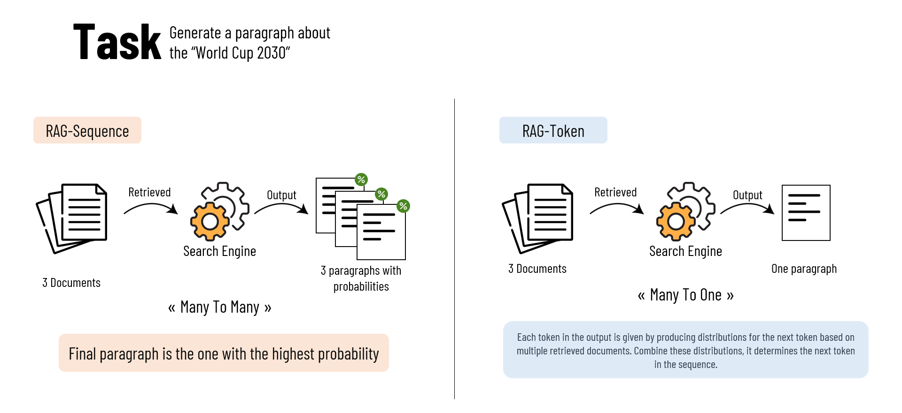

# Retrieval-Augmented Generation (RAG): To add External Knowledge

## What is this "RAG"?

Let's go straight to the point, **(RAG)** or **R**etrieval-**A**ugmented **G**eneration, enriches the model's input with external data. The idea is to provide more context to the model for improving the output. 

This approach reduces misinformation, hallucinations, and offers cost-efficient access to a specific information, making it a valuable tool for improving language models' performance. 

It also simplifies the process of updating or removing biased or irrelevant content.

## Why RAG?

RAG addresses the limitations of pre-trained language models by combining retrieval and generation techniques.

But..How?

Before delving into RAG, it's essential to grasp the concept of **"text embeddings"**. 

A simple way to see it is to envision a fixed-size vector of numbers, that best represents the text data.

These embeddings, or vector representations, capture semantic similarities among texts, making them useful for various tasks. 

By using text embeddings as a universal encoding for text, similar text items are represented closely in the vector space, allowing for effective information retrieval. 

RAG builds on the idea of using dense embeddings for document retrieval, which outperforms traditional methods and improves overall accuracy on specific tasks, question-answering for example.

It leverages both "non-parametric" retrieval systems and "parametric" generation systems to enhance the performance of  language models.

*In the context of question-answering, and for retrieval systems, the idea is to retrieve the most relevant pieces of text from a set of knowledge, to the question. No parameters involved. As for the generation systems, they rely on the number of retrieved texts, therefore it's parametric.*

## More about RAG

RAG's roots lie in open-domain question-answering, where it retrieves relevant documents and provides them as context to language models. 

**D**ense **P**assage **R**etrieval **(DPR)** is a key component of RAG, utilizing dense embeddings and training encoders to improve retrieval precision. 

Two RAG approaches can be mentioned that differ in how they use retrieved documents for generating output:

1. **RAG-Sequence**
- In this approach, the model uses the same document to generate the complete output sequence.
- It means that for each retrieved document, the model produces a full output sequence.
- Then, it calculates the probability of each generated output sequence.
- The probabilities are added up (marginalized) based on the likelihood of each document being retrieved.
- Finally, the model selects the output sequence with the highest probability.

2. **RAG-Token**
- In this approach, each token in the output is generated based on a different document.
- The model first produces a distribution for the next output token for each of the retrieved documents.
- These distributions represent the likelihood of a particular token given each document.
- The model then combines these distributions to determine the next token.
- This process is repeated for each token in the sequence.

## Fusion-in-Decoder (FiD): To Enhance open-domain QA

**FiD** combines retrieval and generative models for open-domain question-answering (QA). 

It efficiently **(1)** retrieves relevant passages, **(2)** processes them independently in the encoder, and then **(3)** aggregates context during decoding.

This approach allows FiD to scale to a large number of passages while maintaining computational efficiency.

### How does Fusion-in-Decoder work?

FiD concatenates retrieved passages with questions and titles, processing them in the encoder. 

It employs special tokens to identify different sections and facilitates self-attention over one context at a time.

During decoding, the decoder processes the encoded passages jointly to better incorporate context from multiple retrieved passages, improving the overall QA performance.

*Read More about **FiD**: https://arxiv.org/abs/2212.08153*

## Retrieval-Enhanced Transformer (RETRO): Finer-grained retrieval during generation

**RETRO** enhances generation using a combination of frozen BERT retrievers, differentiable encoders, and chunked cross-attention.

It performs retrieval throughout the pre-training stage, allowing for finer-grained and repeated retrieval during generation, rather than a single retrieval per query.

### How does RETRO work?

Suppose we want to generate a detailed paragraph about the "World Cup 2030" using RETRO:

**1. Input Sequences Split into Chunks:**

The input text might be: **"The World Cup 2030 will be hosted in Morocco, Spain, and Portugal. It will gring together nations from across the globe to compete in the beautiful game."**

RETRO first splits this input into smaller, meaningful chunks, such as:
- **Chunk 1:** "The World Cup 2030 will be hosted in Morocco, Spain, and Portugal."
- **Chunk 2:** "It will gring together nations from across the globe to compete in the beautiful game."

**2. Chunk-Based Retrieval:**

RETRO starts by retrieving relevant information for Chunk 1.
It uses the RETRO retrieval method, which relies on **A**pproximate **N**earest **N**eighbors (**ANN**) and **BERT** embeddings to find similar chunks from a large collection of documents.

Let's say it retrieves additional information about the 2030 World Cup from various sources for Chunk 1.

**3. Contextual Information:**

Now that RETRO has retrieved additional information for Chunk 1, it uses this context to generate the next chunk, which is Chunk 2.

When generating Chunk 2 ("It will gring together nations from across the globe to compete in the beautiful game."), RETRO knows more about the 2030 World Cup due to the information retrieved for Chunk 1.

It can generate a more contextually relevant and detailed description based on the retrieved data.

**4. Repeated Retrieval:**

RETRO continues this process of splitting the input into chunks and retrieving information.

For each new chunk, it retrieves relevant data based on the previous chunk, allowing for fine-grained and context-aware generation.

*Read More about **RETRO**: https://arxiv.org/abs/2112.04426*

## Internet-augmented Language Models: Leveraging web search for augmentation

Internet-augmented Language Models use web search engines to enhance language models. They (1) Retrieve relevant documents from search results, (2) Segment them into paragraphs, and (3) Use TF-IDF and cosine similarity to rank paragraphs. 

This approach enriches language models with up-to-date and diverse information.

### Overview of Internet-augmented LLMs

Retrieved paragraphs are used to condition language models via few-shot prompting, extending conventional question-answer pairs with evidence paragraphs. 

## RAG for CodeT5+: To Enhance code generation with retrieval

RAG has been applied to code generation tasks, particularly in combination with **CodeT5+**. 

It improves code generation by leveraging retrieval to provide crucial context for generating accurate code. 

RAG for CodeT5+ offers three settings: 

* Retrieval-based, 

* Generative-only, and 

* Retrieval-augmented,

each with its advantages in different scenarios.

Retrieved code samples are used to enhance code generation. The retrieved code serves as valuable context, guiding the generative system to produce more accurate and contextually relevant code compared to generative-only approaches.

## Hypothetical Document Embeddings (HyDE): A solution for relevance modeling

**HyDE** addresses the challenge of relevance modeling when there are no relevance judgments for query-passage pairs.

It generates hypothetical documents using language models, encodes them into embeddings, and retrieves similar real documents based on these embeddings.

This approach reframes relevance modeling as a generation task, providing a solution for situations where relevance judgments are unavailable.

### Overview of HyDE

**HyDE** prompts a language model to generate hypothetical documents, encodes them into embeddings, and computes their similarity with real documents. 

By using an unsupervised encoder, non-factual details are excluded, making it a viable solution for relevance modeling in data-scarce scenarios.

## How to apply RAG: Practical considerations

To apply RAG effectively, a hybrid retrieval approach 

combining traditional search indices with embedding-based search is recommended. 

This approach overcomes limitations in both keyword-based and embedding-based searches, ensuring robust and contextually relevant information retrieval. 

Various text embedding models are available, each with its strengths, making it crucial to choose the right one based on specific requirements and benchmarks. 

Additionally, employing Approximate Nearest Neighbors (ANN) search indices optimizes retrieval speed and efficiency, and several techniques, including LSH, FAISS, HNSW, and ScaNN, can be utilized to build efficient ANN indices based on different functional and non-functional requirements.